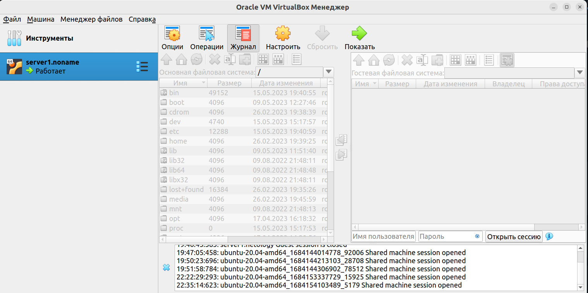

1. **-Опишите основные преимущества применения на практике IaaC-паттернов.
     -Какой из принципов IaaC является основополагающим?**
     
- Скорость и уменьшение затрат: позволяет быстрее конфигурировать инфраструктуру и направлен на обеспечение прозрачности.
- Восстановление в аварийных ситуациях: эффективный способ отслеживания инфраструктуры и повторного развертывания
последнего работоспособного состояния после сбоя или катастрофы любого рода.
- Безопасность и документирование: за провижен всех вычислительных, сетевых и служб хранения отвечает код,они каждый раз будут развертываться одинаково. Т.к. код можно версионировать, IaaC позволяет документировать, регистрировать
и отслеживать каждое изменение конфигурации вашего сервера.
- Масштабируемость и стандартизация: развертывания инфраструктуры с помощью IaaC повторяемы и предотвращают проблемы во время выполнения, вызванных дрейфом конфигурации или отсутствием зависимостей. IaaC полностью стандартизирует сетап инфраструктуры,
что снижает вероятность ошибок или отклонений.

  **-Какой из принципов IaaC является основополагающим?**

Идемпотентность операций - свойство сценария/операции позволяющее многократно получать/воспроизводить одно и то же состояние объекта (среды) что и при первом применении, т.е. не зависимо от того сколько раз будет проигран сценарий, результат всегда будет идентичен результату полученному в первый раз.

2. **Чем Ansible выгодно отличается от других систем управление конфигурациями?**  

Не требует установки агентов на клиентах, использует SSH или WinRM соединение. Низкий порог входа, поддержка декларативного и императивного подхода, описание конфигурации - «плейбуки» вформате YAML Поддерживает широкий набор модулей позволяющих управлять конфигурацией как ОС, так и различным ПО и сетевым оборудованием. Ansible Galaxy - публичный репозиторий, в котором размещается огромное количество готовых ролей Ansible.

**-Какой, на ваш взгляд, метод работы систем конфигурации более надёжный push или pull?**

На мой взгляд более надёжный push - позволяет определить когда, кдуа и какую конфигурацию отправить, так же позволяет проконтролировать результат применения.

3. **Установить на личный компьютер:**

- VirtualBox:

- Vagrant:
noname@noname:~/DevOps/virtual$ vagrant --version
Vagrant 2.3.4

- Terraform:
noname@noname:~$ terraform --version
Terraform v1.4.6
on linux_amd64

- Ansible: 
noname@noname:~/DevOps/virtual$ ansible --version
ansible 2.10.8
  config file = None
  configured module search path = ['/home/noname/.ansible/plugins/modules', '/usr/share/ansible/plugins/modules']
  ansible python module location = /usr/lib/python3/dist-packages/ansible
  executable location = /usr/bin/ansible
  python version = 3.10.6 (main, Mar 10 2023, 10:55:28) [GCC 11.3.0]

