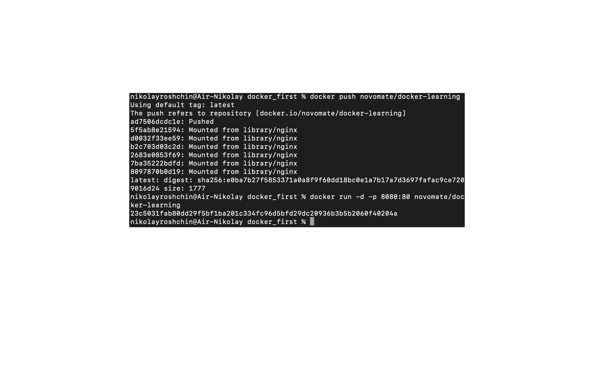
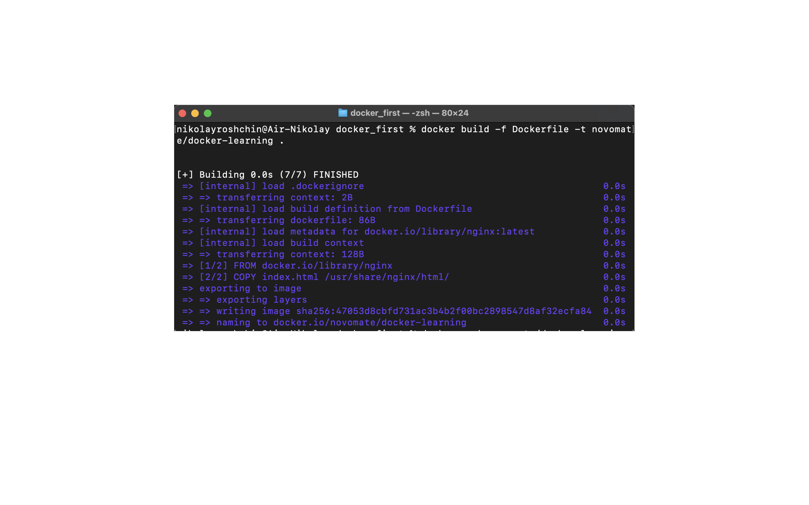
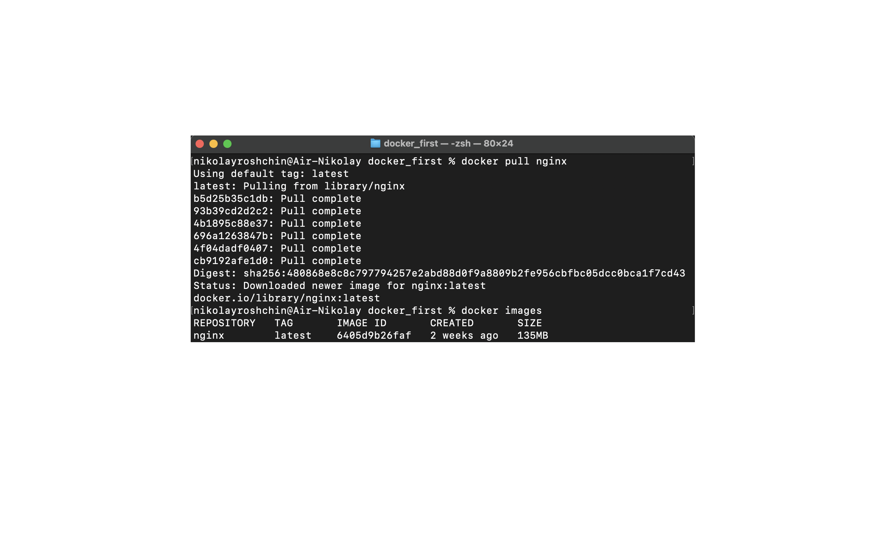
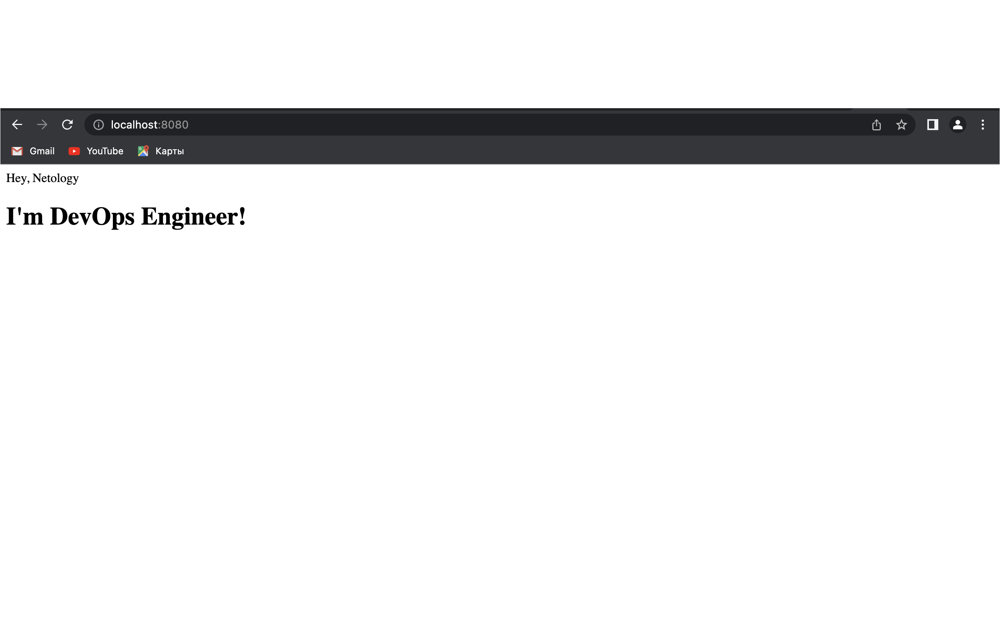
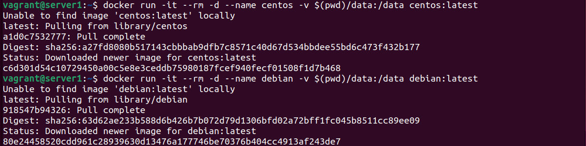
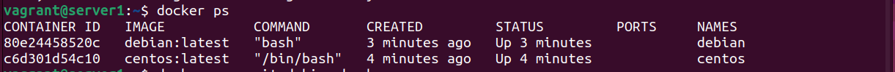
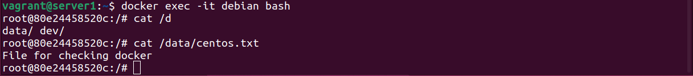

1. **Задача 1**
    
    Сценарий выполнения задачи:

    - создайте свой репозиторий на https://hub.docker.com;
    - выберите любой образ, который содержит веб-сервер Nginx;
    - создайте свой fork образа;
    - реализуйте функциональность: запуск веб-сервера в фоне с индекс-страницей, содержащей HTML-код

    

    

    
    
    

    Опубликуйте созданный fork в своём репозитории: https://hub.docker.com/repository/docker/novomate/docker-learning/general

2. **Задача 2**

    Посмотрите на сценарий ниже и ответьте на вопрос: «Подходит ли в этом сценарии использование Docker-контейнеров или лучше подойдёт виртуальная машина, физическая машина? Может быть, возможны разные варианты?»

    Высоконагруженное монолитное java веб-приложение; Целесообразно использовать виртуальные или физические машины, docker для этого менее пригоден, т.к. типичное монолитное приложение обычно тяжеловесно, имеет более длительное время запуска, выполняет несколько процессов, имеет зависимости которые следует учитывать при проектировании других контейнеров.

    - Nodejs веб-приложение; Подойдет Docker. Простота развертывания приложения, лёгковесность и масштабирование.

    - Мобильное приложение c версиями для Android и iOS; Не уверен что docker является здесь целевым, есть решения для организации сборки мобильных приложений (apk, deb, ipa), если под версией имеется ввиду обычное веб приложение тогда возможно подойдёт любой из сценариев, преимущества docker в этом случае - быстрое развёртывание и лёгкость масштабирование приложения.

    - Шина данных на базе Apache Kafka; т.к. шина данных является специфическим связующим звеном, в текущих проектах мы используем физические и виртуальные сервера - в основном связано с тем что при переконфигурировании шины велика вероятность потери отправленных данных.

    - Elasticsearch кластер для реализации логирования продуктивного веб-приложения - три ноды elasticsearch, два logstash и две ноды kibana; При организации логгирования с использованием elk-стека есть несколько вопросов ответы на который позволяют определить что будет использовано: 1. Объём логов 2. Период хранения 3. скорость поиска - в случае высоконагруженных систем с большими объёмами и сроками хранения логов целесообразно использовать физические/виртуальные сервера, т.к. стек elk обычно хорошо утилизирует сервера.

    - Мониторинг-стек на базе Prometheus и Grafana; docker - масштабируемость, лёгкость и скорость развёртывания.

    - MongoDB, как основное хранилище данных для java-приложения; Склоняюсь к физическим или виртуальным серверам, ввиду сложности администрирования MongoDB внутри контейнера и вероятности потери данных при потере контейнера.

    - Gitlab сервер для реализации CI/CD процессов и приватный (закрытый) Docker Registry. Docker не подходит в данном случае, т.к. при потере контейнера будет сложно восстановить частоизменяемые данные. Здесь больше подходят физические или виртуальные сервера.

3. **Задача 3**

    - Запустите первый контейнер из образа centos c любым тегом в фоновом режиме, подключив папку /data из текущей рабочей директории на хостовой машине в /data контейнера.
    - Запустите второй контейнер из образа debian в фоновом режиме, подключив папку /data из текущей рабочей директории на хостовой машине в /data контейнера.
    - Подключитесь к первому контейнеру с помощью docker exec и создайте текстовый файл любого содержания в /data.
    - Добавьте ещё один файл в папку /data на хостовой машине.
    - Подключитесь во второй контейнер и отобразите листинг и содержание файлов в /data контейнера.

    

    

    

    
