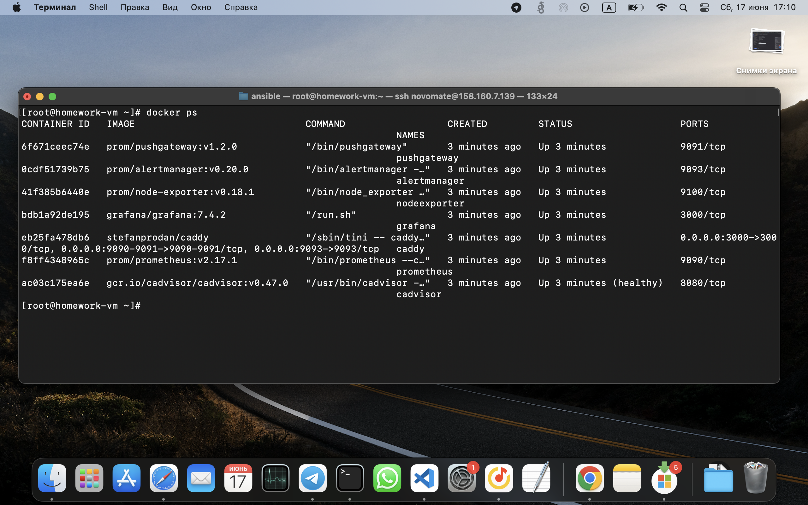

**Задача 1**

    Создайте собственный образ любой операционной системы (например ubuntu-20.04) с помощью Packer

    

**Задача 2**

    Создайте вашу первую виртуальную машину в YandexCloud с помощью web-интерфейса YandexCloud.

    

**Задача 3**

    С помощью Ansible и Docker Compose разверните на виртуальной машине из предыдущего задания систему мониторинга на основе Prometheus/Grafana.

    

**Задача 4**

    

**Задача 5 (*)**

    Создаём вторую ВМ:

    

    На первой ВМ, с которой будет осуществляться мониторинг добавляем target в конфигурацию prometheus (prometheus.yml), в которой прописываем доступ к node-exporter второй ВМ:

    

    После этого перезагружаем контейнер prometheus на первой ВМ, чтобы он подхватил новые настройки и проверяем, что в prometheus добавился мониторинг второй ВМ:

    

    Далее добавил в Grafana первой ВМ дашборд Node Exporter for Prometheus в котором можно вибирать мониторинг между добавленных хостов. Выбираем вторую ВМ и мониторим:

    

